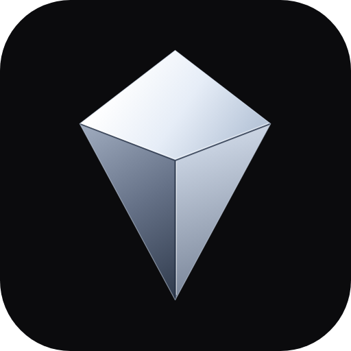
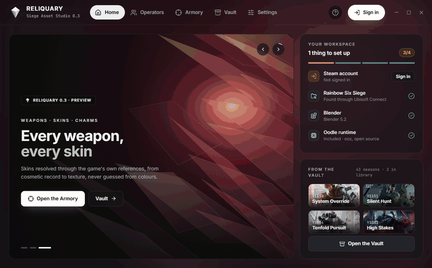
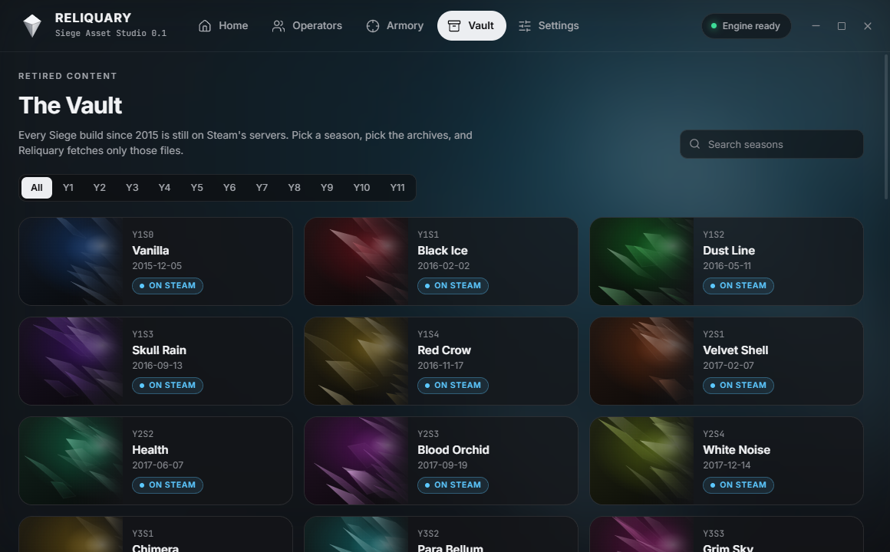
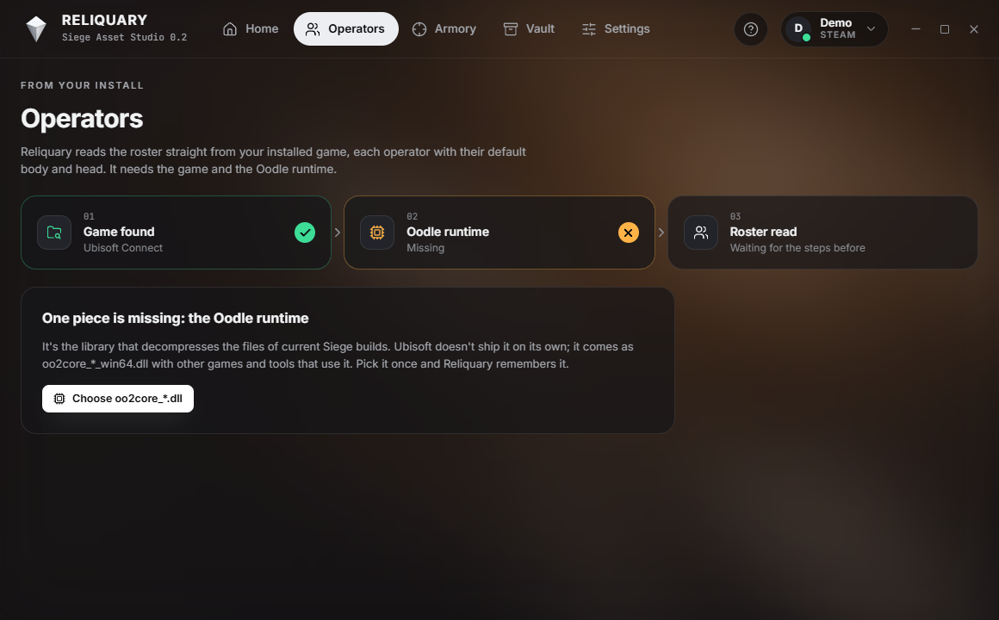

<p align="center">
  
</p>

<h1 align="center">Reliquary</h1>

<p align="center">
  Uno studio desktop per gli asset di Rainbow Six Siege: stagioni ritirate, operatori, armi, skin e ciondoli, dritti in Blender.<br />
  <a href="README.md">Read in English</a>
</p>



> **Anteprima.** L'Archivio funziona dall'inizio alla fine. Operatori e Armeria sono in costruzione: vedi [Stato](#stato).

## Download

Scarica l'ultima versione dalle **[Releases](https://github.com/Fialsss/Reliquary/releases/latest)**:

- `Reliquary-Setup-x.y.z.exe`: installer con collegamenti nel menu Start e sul desktop
- `Reliquary-x.y.z-portable.exe`: un solo file, senza installazione

Contengono già tutto quello che serve, quindi non devi installare Python o Node. Windows 10/11 a 64 bit.

Le build non sono ancora firmate, quindi la prima volta Windows SmartScreen può mostrare *"PC protetto da Windows"*. Clicca **Ulteriori informazioni → Esegui comunque**. Il sorgente di ogni build è questa repository.

## Primi passi

Al primo avvio l'app apre una guida passo per passo, e il pulsante **?** nella barra in alto la riapre quando vuoi. In breve:

1. **Accedi con Steam.** Premi *Accedi con Steam* in alto a destra e inquadra il QR con l'app di Steam sul telefono (scudo → *Scansiona un codice QR*). L'account deve possedere Rainbow Six Siege su Steam. Poi in alto compaiono il tuo nome Steam e la tua foto.
2. **Apri l'Archivio** e scegli una stagione. Ogni scheda è la build originale uscita in quel periodo.
3. **Carica l'elenco dei file.** Reliquary chiede a Steam quali archivi contiene quella build, con le dimensioni.
4. **Spunta quello che ti serve.** Gli archivi *Dati* sono piccoli (tabelle, materiali, riferimenti), le *Texture* pesano da 2 a 9 GB l'una, i *Modelli* sono le geometrie 3D. Per una prima prova scegli un file piccolo.
5. **Scarica.** Il download va in sottofondo e l'avanzamento resta nella barra in alto. I file finiscono nella cartella Libreria, che apri dal menu account.

Per ora gli archivi scaricati restano sul tuo disco. Aprirli e portare skin, armi e ciondoli in Blender è quello che aggiungono le prossime versioni.

## Cosa fa

**L'Archivio: contenuti ritirati, un archivio alla volta.** Steam conserva ancora ogni build di Siege pubblicata dal 2015. Reliquary elenca tutte le 43 stagioni, da Y1S0 Vanilla a Y11S2, chiede a Steam l'elenco dei file della build che scegli e scarica solo gli archivi che spunti. Non serve scaricare l'intero gioco da oltre 60 GB. L'accesso si fa una volta sola, inquadrando un QR con l'app di Steam direttamente dentro la finestra, e il tuo profilo Steam compare nella barra in alto. I download continuano mentre usi il resto dell'app.

È così che è stata recuperata la **Glacier originale del 552 Commando (Y5S4)**, che nel gioco attuale non esiste più. Le sue texture stavano in un solo archivio da 9 GB della build Neon Dawn.



**Rilevamento della postazione.** Reliquary trova il gioco tramite Ubisoft Connect o le librerie di Steam, trova Blender e ti dice cosa manca.

**Operatori.** Reliquary legge il roster dalla tua installazione con il motore [R6-parser](https://github.com/TrueShadow01/R6-parser) incluso. La pagina mostra la catena che serve (gioco trovato → runtime Oodle → lettura del roster) e cosa fare quando manca un anello.

**Armeria (in sviluppo).** È la catena arma → skin → Blender. Le skin vengono ritrovate seguendo i riferimenti interni del gioco (record cosmetico → selezione materiale → bundle materiale → UID delle texture), mai indovinate dall'aspetto. Ogni skin porterà con sé quella catena come prova.



## Stato

| Area | Stato |
| --- | --- |
| Archivio: elenco stagioni, accesso Steam con QR, elenco file, download selettivo, annulla, ripresa | Funziona |
| Rilevamento postazione (Ubisoft Connect, librerie Steam, Blender) | Funziona |
| Roster operatori | Il lettore va aggiornato all'ultima build del gioco (è cambiato il formato del registro) |
| Armi, accessori, skin, ciondoli, scena Blender con cambia-skin | Metodo dimostrato a mano sul 552 Commando, integrazione nell'app come prossimo passo |
| Installer e versione portable, senza dipendenze | Funziona |

## Requisiti

- Windows 10 o 11 a 64 bit
- **Per l'Archivio:** un account Steam che possiede Rainbow Six Siege
- **Per leggere le build attuali:** un runtime Oodle (`oo2core_*_win64.dll`) che hai il diritto di usare. Non è incluso: imposta il percorso nelle Impostazioni.
- [Blender](https://www.blender.org) per le esportazioni

## Avvio dal sorgente

Servono [Node.js](https://nodejs.org) 20+ e [Python](https://www.python.org) 3.10+.

```powershell
git clone https://github.com/Fialsss/Reliquary.git
cd Reliquary
npm install
py -3 -m pip install -r engine/requirements.txt
npm run dev
```

Per usare un Python che non è nel `PATH`, imposta `RELIQUARY_PYTHON` con il suo percorso completo.

Per creare l'installer e l'exe portable in `dist/`: `py -3 -m pip install pyinstaller`, poi `npm run dist`.

<details>
<summary>Problemi comuni</summary>

- **L'app parte come Node semplice e fallisce con `Cannot read properties of undefined (reading 'handle')`.** Qualcosa ha impostato `ELECTRON_RUN_AS_NODE=1` nell'ambiente (lo fanno alcune estensioni degli editor). Toglila: `Remove-Item Env:ELECTRON_RUN_AS_NODE`.
- **"This Steam account doesn't own Rainbow Six Siege".** Steam dà accesso ai depot solo agli account che possiedono il gioco. Possedere Siege solo su Ubisoft Connect non basta per l'Archivio.
- **L'accesso Steam salvato è scaduto.** Reliquary se ne accorge, lo dimentica e mostra un QR nuovo.

</details>

## Come funziona

```text
Electron + React (src/)  ── righe JSON su stdio ──  motore Python (engine/reliquary)
                                                     ├─ vault.py      DepotDownloader: QR, manifest, download
                                                     ├─ env.py        rilevamento gioco / Blender / Oodle
                                                     ├─ operators.py  roster tramite R6-parser incluso
                                                     └─ r6parser/     archivi Forge, modelli, texture (GPL-3.0)
```

La finestra non accede mai direttamente alla rete o al disco. Ogni azione è una richiesta al motore, e i lavori lunghi rimandano indietro l'avanzamento come eventi. L'Archivio pilota [DepotDownloader](https://github.com/SteamRE/DepotDownloader) con il manifest ID di ogni stagione (`engine/reliquary/data/seasons.json`). DepotDownloader viene scaricato dalla sua release ufficiale al primo uso.

## Cosa Reliquary non fa

- **Non contiene file del gioco.** Tutto viene letto dalla tua installazione o scaricato da Steam con il tuo account.
- Non include Oodle, che è proprietario.
- Le immagini delle stagioni vengono caricate al momento dalla wiki Fandom di Rainbow Six e non sono salvate nella repository.
- Gli asset estratti appartengono a Ubisoft. Usali per render personali e fan art, e non ridistribuirli.

## Crediti

- [R6-parser](https://github.com/TrueShadow01/R6-parser) di TrueShadow01: il lettore Forge in `engine/r6parser` (GPL-3.0)
- [DepotDownloader](https://github.com/SteamRE/DepotDownloader) di SteamRE (GPL-2.0), scaricato all'avvio
- [RainbowForge](https://github.com/parzivail/RainbowForge) di parzivail, le cui ricerche sul formato hanno reso possibile tutto questo

Dettagli in [THIRD_PARTY.md](THIRD_PARTY.md).

## Licenza e crediti

Reliquary è Copyright (C) 2026 **Fialsss**, rilasciato sotto [GPL-3.0](LICENSE) con un termine aggiuntivo (sezione 7(b)): le copie e i lavori derivati devono mantenere la dicitura **"Based on Reliquary by Fialsss — https://github.com/Fialsss/Reliquary"** nella loro documentazione e nella loro schermata crediti o informazioni. Dettagli in [NOTICE.md](NOTICE.md).

 Rainbow Six Siege è un marchio di Ubisoft Entertainment. Questo progetto non è affiliato né approvato da Ubisoft o Valve.
