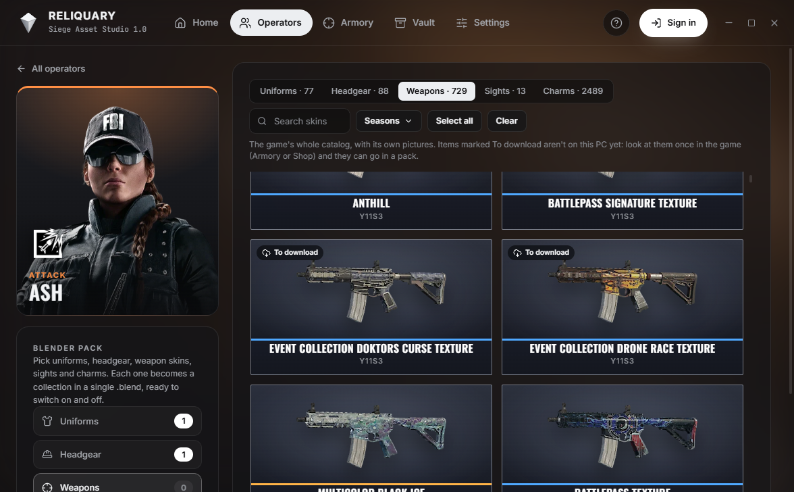
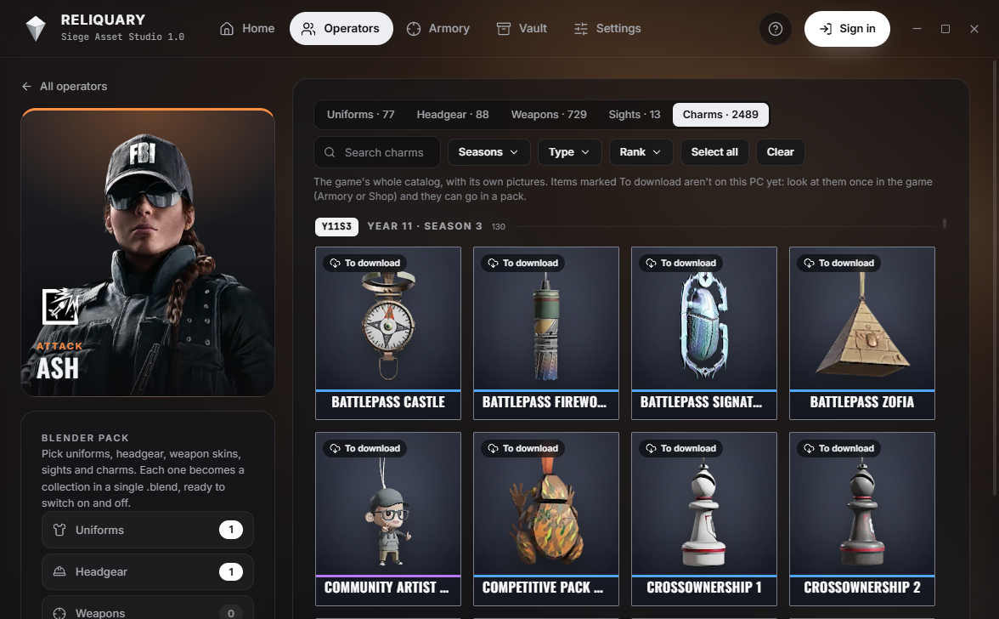
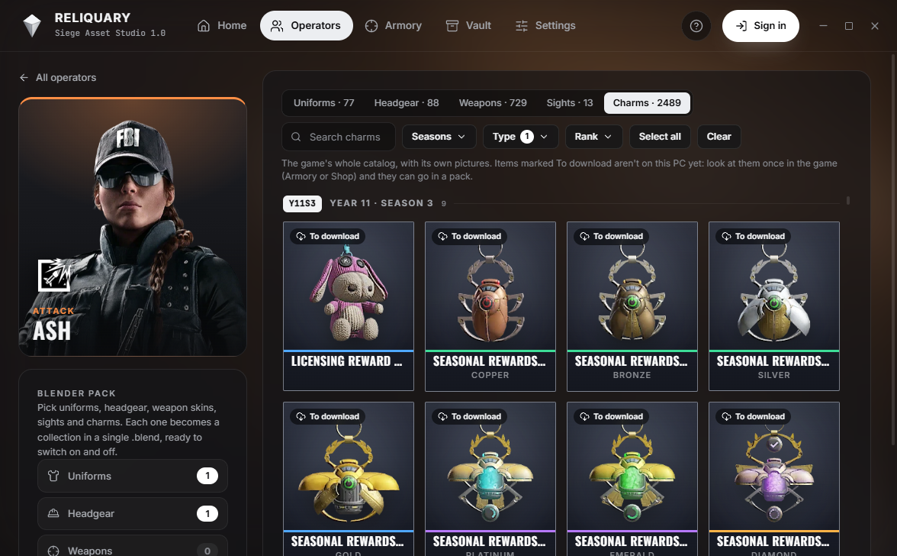
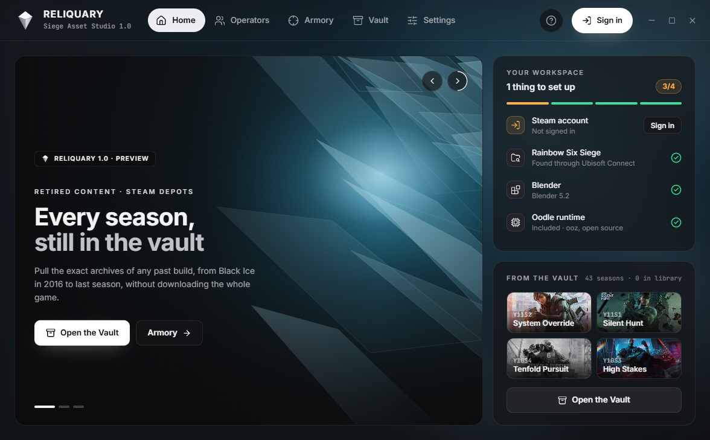

<div align="center">
  
  <h1>Reliquary</h1>
  <p>
    <b>Rainbow Six Siege, dritto in Blender.</b><br />
    Ogni operatore, skin d'arma e ciondolo del gioco, con le sue immagini, in un unico .blend pronto da usare. Le stagioni ritirate da Steam, un archivio alla volta.
  </p>
  <p>
    
    
    
  </p>
  <p><a href="README.md">Read in English</a></p>
  
</div>

> [!WARNING]
> Reliquary è ancora in sviluppo: aspettati qualche imperfezione. Archivio e Operatori funzionano dall'inizio alla fine; la pagina Armeria è in costruzione. È un progetto di fan, non affiliato, approvato né sponsorizzato da Ubisoft o Valve.

## Uno sguardo

<table>
  <tr>
    <td width="50%"></td>
    <td width="50%"></td>
  </tr>
  <tr>
    <td><b>Operatori.</b> I ritratti e gli emblemi del gioco, attaccanti e difensori separati.</td>
    <td><b>Tutte le skin d'arma.</b> L'intero catalogo di ogni arma, con le anteprime del gioco: universali e solo per quell'arma.</td>
  </tr>
  <tr>
    <td></td>
    <td></td>
  </tr>
  <tr>
    <td><b>Tutti i 2.489 ciondoli,</b> stagione per stagione, con icone, rarità e ricerca.</td>
    <td><b>Filtri.</b> Per stagione, tipo (ranked, battle pass, esports, chibi, eventi) e grado, dal Rame al Campione.</td>
  </tr>
  <tr>
    <td></td>
    <td></td>
  </tr>
  <tr>
    <td><b>L'Archivio.</b> Tutte le 43 stagioni ancora su Steam, scaricate un archivio alla volta.</td>
    <td><b>Home.</b> La postazione a colpo d'occhio: Steam, gioco, Blender, Oodle.</td>
  </tr>
</table>

## Download

Scarica l'ultima versione dalle **[Releases](https://github.com/Fialsss/Reliquary/releases/latest)**:

- `Reliquary-Setup-x.y.z.exe`: installer con collegamenti nel menu Start e sul desktop
- `Reliquary-x.y.z-portable.exe`: un solo file, senza installazione

Contengono già tutto quello che serve, quindi non devi installare Python o Node. Windows 10/11 a 64 bit.

Le build non sono ancora firmate, quindi la prima volta Windows SmartScreen può mostrare *"PC protetto da Windows"*. Clicca **Ulteriori informazioni → Esegui comunque**. Il sorgente di ogni build è questa repository.

## Primi passi

Al primo avvio l'app apre una guida passo per passo, e il pulsante **?** nella barra in alto la riapre quando vuoi. In breve:

1. **Accedi con Steam.** Premi *Accedi* in alto a destra, poi inquadra il QR con l'app di Steam sul telefono (scudo → *Scansiona un codice QR*) oppure passa a *Password* e scrivi nome account e password; codici Steam Guard e conferme sul telefono vengono chiesti direttamente nella finestra. L'account deve possedere Rainbow Six Siege su Steam. Poi in alto compaiono il tuo nome Steam e la tua foto.
2. **Apri l'Archivio** e scegli una stagione. Ogni scheda è la build originale uscita in quel periodo.
3. **Carica l'elenco dei file.** Reliquary chiede a Steam quali archivi contiene quella build, con le dimensioni.
4. **Spunta quello che ti serve.** Gli archivi *Dati* sono piccoli (tabelle, materiali, riferimenti), le *Texture* pesano da 2 a 9 GB l'una, i *Modelli* sono le geometrie 3D. Per una prima prova scegli un file piccolo.
5. **Scarica.** Il download va in sottofondo e l'avanzamento resta nella barra in alto. I file finiscono nella cartella Libreria, che apri dal menu account.

Poi **Apri questa build** nella stessa pagina: Reliquary legge un archivio di texture scaricato e salva le texture in PNG, filtrate per dimensione e tipo (colore, normal, speculare, maschere), mostrando prima lo spazio su disco che serviranno. Provato su una build completa della Y2S3 Blood Orchid: skin d'arma ritirate e uniformi escono intatte. Funziona con le build nel formato Forge vecchio (Zstandard, v29 e vicine); mesh e formato attuale sono il passo successivo.

## Cosa fa

**L'Archivio: contenuti ritirati, un archivio alla volta.** Steam conserva ancora ogni build di Siege pubblicata dal 2015. Reliquary elenca tutte le 43 stagioni, da Y1S0 Vanilla a Y11S2, chiede a Steam l'elenco dei file della build che scegli e scarica solo gli archivi che spunti. Non serve scaricare l'intero gioco da oltre 60 GB. L'accesso si fa una volta sola, inquadrando un QR con l'app di Steam direttamente dentro la finestra, e il tuo profilo Steam compare nella barra in alto. I download continuano mentre usi il resto dell'app.

È così che è stata recuperata la **Glacier originale del 552 Commando (Y5S4)**, che nel gioco attuale non esiste più. Le sue texture stavano in un solo archivio da 9 GB della build Neon Dawn.

**Rilevamento della postazione.** Reliquary trova il gioco tramite Ubisoft Connect o le librerie di Steam, trova Blender e ti dice cosa manca.

**Operatori → pack Blender.** Il roster arriva con i ritratti e gli emblemi del gioco, diviso in attaccanti e difensori. Scegli un operatore e cosa mettere nel pack: uniformi e copricapi (con nomi e stagioni; i set Elite hanno lo sfondo dorato), le sue armi col caricatore e **tutte le skin che il gioco ha per loro**, universali e solo per quell'arma, mimetiche comprese, i mirini e **tutti i ciondoli del gioco**, divisi per stagione e filtrabili per tipo e grado. Tutto arriva dal gioco stesso: il suo catalogo del negozio (nomi, stagioni, rarità) e le sue immagini (le anteprime 440x144 delle skin e le icone dei ciondoli che vedi nel gioco). **Crea pack Blender** esporta tutto e fa costruire a Blender un unico `.blend`: una collezione per ogni uniforme, copricapo, skin d'arma e mirino, da accendere e spegnere, con armi, mirini e ciondoli accanto all'operatore. Uniformi, copricapi e armi arrivano dalla tua installazione (li legge [R6-parser](https://github.com/TrueShadow01/R6-parser), il cui add-on ricostruisce i materiali di Siege). Skin d'arma e ciondoli il gioco li scarica quando servono: quelli già sul tuo PC possono andare nel pack, gli altri sono segnati *Da scaricare* finché non li guardi una volta nel gioco (Armeria o Negozio). La prima volta crea l'indice degli asset (pochi minuti, circa 130 MB); rifallo dopo gli aggiornamenti del gioco.

**Armeria (in sviluppo).** È la catena arma → skin → Blender. Le skin vengono ritrovate seguendo i riferimenti interni del gioco (record cosmetico → selezione materiale → bundle materiale → UID delle texture), mai indovinate dall'aspetto. Ogni skin porterà con sé quella catena come prova.

## Stato

| Area | Stato |
| --- | --- |
| Archivio: elenco stagioni, accesso Steam con QR, elenco file, download selettivo, annulla, ripresa | Funziona |
| Rilevamento postazione (Ubisoft Connect, librerie Steam, Blender) | Funziona |
| Pack Blender dell'operatore: uniformi e copricapi, armi col caricatore, skin d'arma (anche mimetiche), mirini e ciondoli in un unico `.blend` | Funziona (78 operatori sulla build attuale; provato in Blender 5.2). Alcuni mirini (Holo A) non si possono ancora esportare |
| L'intero catalogo del gioco con le sue immagini: ogni skin d'arma (4.765) e ciondolo (2.489), con stagioni, rarità e gradi | Funziona. Per esportare un oggetto serve che il gioco l'abbia scaricato; gli altri sono segnati *Da scaricare* |
| Armi, accessori, skin, ciondoli, scena Blender con cambia-skin | Metodo dimostrato a mano sul 552 Commando, integrazione nell'app come prossimo passo |
| Installer e versione portable, senza dipendenze | Funziona |
| Accesso Steam: codice QR, oppure nome account e password con Steam Guard | Funziona |
| Lettura dei file attuali del gioco senza Oodle (ooz open source incluso) | Funziona |
| Spazio su disco: vedere ed eliminare archivi scaricati e cache | Funziona |
| Build vecchie: texture degli archivi scaricati in PNG (Forge v29, Zstandard) | Funziona (provato sulla Y2S3); mesh come prossimo passo |

## Requisiti

- Windows 10 o 11 a 64 bit
- **Per l'Archivio:** un account Steam che possiede Rainbow Six Siege
- [Blender](https://www.blender.org) per le esportazioni

## Avvio dal sorgente

Servono [Node.js](https://nodejs.org) 20+ e [Python](https://www.python.org) 3.10+.

```powershell
git clone https://github.com/Fialsss/Reliquary.git
cd Reliquary
npm install
py -3 -m pip install -r engine/requirements.txt
npm run dev
```

Per usare un Python che non è nel `PATH`, imposta `RELIQUARY_PYTHON` con il suo percorso completo.

Per creare l'installer e l'exe portable in `dist/`: `py -3 -m pip install pyinstaller`, poi `npm run dist`. Servono gli strumenti C++ di Visual Studio, che compilano il decompressore ooz incluso (`engine/native/ooz`).

<details>
<summary>Problemi comuni</summary>

- **L'app parte come Node semplice e fallisce con `Cannot read properties of undefined (reading 'handle')`.** Qualcosa ha impostato `ELECTRON_RUN_AS_NODE=1` nell'ambiente (lo fanno alcune estensioni degli editor). Toglila: `Remove-Item Env:ELECTRON_RUN_AS_NODE`.
- **"This Steam account doesn't own Rainbow Six Siege".** Steam dà accesso ai depot solo agli account che possiedono il gioco. Possedere Siege solo su Ubisoft Connect non basta per l'Archivio.
- **L'accesso Steam salvato è scaduto.** Reliquary se ne accorge, lo dimentica e mostra un QR nuovo.

</details>

## Come funziona

```text
Electron + React (src/)  ── righe JSON su stdio ──  motore Python (engine/reliquary)
                                                     ├─ vault.py      DepotDownloader: QR, manifest, download
                                                     ├─ env.py        rilevamento gioco / Blender / Oodle
                                                     ├─ operators.py  roster, immagini e pack tramite R6-parser incluso
                                                     ├─ catalog.py    il catalogo del negozio del gioco: ogni skin e ciondolo
                                                     ├─ dcache.py     la cache dei download del gioco (skin e ciondoli scaricati)
                                                     └─ r6parser/     archivi Forge, modelli, texture (GPL-3.0)
```

La finestra non accede mai direttamente alla rete o al disco. Ogni azione è una richiesta al motore, e i lavori lunghi rimandano indietro l'avanzamento come eventi. L'Archivio pilota [DepotDownloader](https://github.com/SteamRE/DepotDownloader) con il manifest ID di ogni stagione (`engine/reliquary/data/seasons.json`). DepotDownloader viene scaricato dalla sua release ufficiale al primo uso.

## Cosa Reliquary non fa

- **Non contiene file del gioco.** Tutto viene letto dalla tua installazione o scaricato da Steam con il tuo account.
- Non include Oodle, che è proprietario. Include invece **ooz**, un decompressore open source per la stessa compressione, verificato con risultati identici sui file attuali del gioco.
- Non include le immagini delle stagioni: l'app le carica al momento dalla wiki Fandom di Rainbow Six. Le schermate di questo README le mostrano, © Ubisoft.
- Gli asset estratti appartengono a Ubisoft. Usali per render personali e fan art, e non ridistribuirli.

## Crediti

- [R6-parser](https://github.com/TrueShadow01/R6-parser) di TrueShadow01: il lettore Forge in `engine/r6parser` (GPL-3.0)
- [DepotDownloader](https://github.com/SteamRE/DepotDownloader) di SteamRE (GPL-2.0), scaricato all'avvio
- [RainbowForge](https://github.com/parzivail/RainbowForge) di parzivail, le cui ricerche sul formato hanno reso possibile tutto questo

Dettagli in [THIRD_PARTY.md](THIRD_PARTY.md).

## Licenza e crediti

Reliquary è Copyright (C) 2026 **Fialsss**, rilasciato sotto [GPL-3.0](LICENSE) con un termine aggiuntivo (sezione 7(b)): le copie e i lavori derivati devono mantenere la dicitura **"Based on Reliquary by Fialsss — https://github.com/Fialsss/Reliquary"** nella loro documentazione e nella loro schermata crediti o informazioni. Dettagli in [NOTICE.md](NOTICE.md).

 Rainbow Six Siege è un marchio di Ubisoft Entertainment. Questo progetto non è affiliato né approvato da Ubisoft o Valve.
